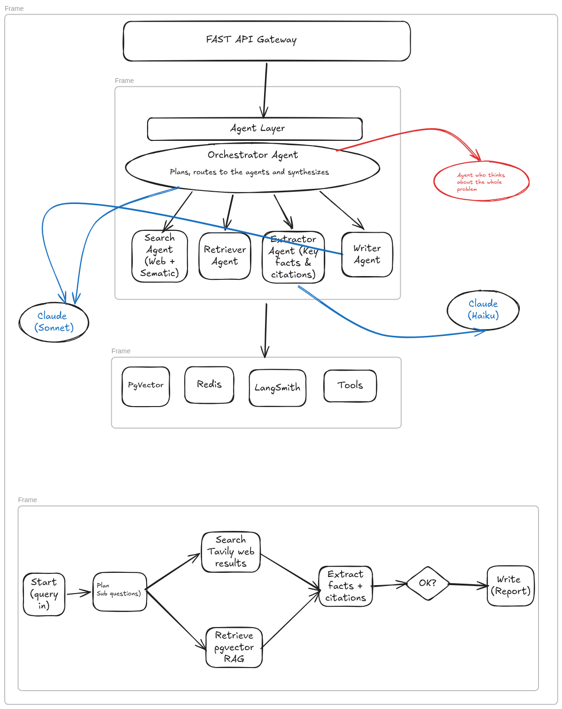
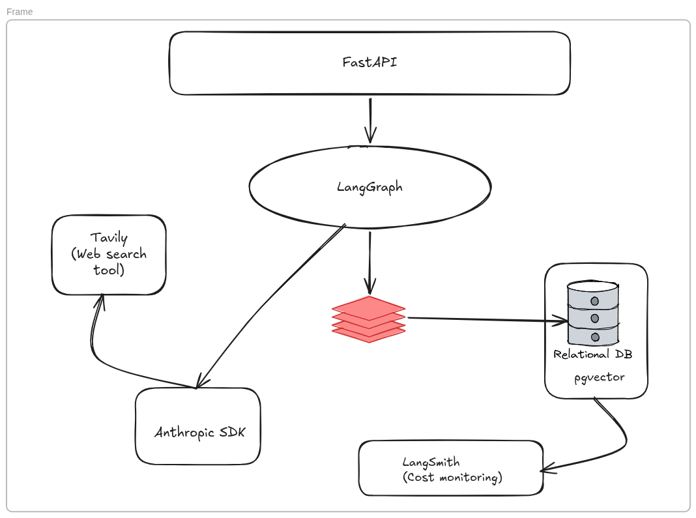

# ResearchMind

> Drop in a query. Get back a full research report.

Think Perplexity — but you own every layer: the orchestration, the search, the synthesis, the write-up.

---

## What it does

ResearchMind takes a single natural-language query and runs it through a pipeline of autonomous agents that:

1. **Plan** — decompose your query into targeted sub-questions
2. **Search** — fan out across the web and a local vector store in parallel
3. **Extract** — pull structured facts from the noise
4. **Evaluate** — decide if the evidence is strong enough, or loop and search again
5. **Write** — produce a structured, cited long-form report

No hand-holding. No follow-up prompts. One query in, one report out.

---

## Architecture



---

## Stack

| Layer | Tech |
|---|---|
| API | FastAPI |
| Agent orchestration | LangGraph |
| LLM | Claude Sonnet + Haiku (Anthropic) |
| Web search | Tavily |
| Streaming + pub/sub | Redis |
| Vector store | pgvector (PostgreSQL) |
| Observability | LangSmith |



---

## Getting started

```bash
git clone https://github.com/your-username/researchmind
cd researchmind
cp .env.example .env        # fill in your API keys
pip install -r requirements.txt
docker-compose up -d        # starts PostgreSQL + Redis
uvicorn app.main:app --reload
```

Submit a research job:

```bash
curl -X POST http://localhost:8000/research \
  -H "Content-Type: application/json" \
  -d '{"query": "What are the latest advances in solid-state batteries?"}'
```

Stream progress in real time:

```bash
curl -N http://localhost:8000/research/{job_id}/stream
```

---

## Environment variables

Copy `.env.example` and fill in the following:

| Variable | Description |
|---|---|
| `ANTHROPIC_API_KEY` | Anthropic API key |
| `TAVILY_API_KEY` | Tavily search API key |
| `DATABASE_URL` | PostgreSQL connection string |
| `REDIS_URL` | Redis connection URL |
| `LANGCHAIN_API_KEY` | LangSmith API key (optional, enables tracing) |

---

## Project structure

```
researchmind/
├── app/
│   ├── agents/
│   │   ├── state.py          # AgentState — shared memory across all nodes
│   │   ├── graph.py          # LangGraph state machine definition
│   │   ├── orchestrator.py   # plan + confidence nodes (Sonnet)
│   │   ├── search.py         # Tavily web search node
│   │   ├── retriever.py      # pgvector RAG node
│   │   ├── extractor.py      # fact extraction node (Haiku)
│   │   └── writer.py         # report generation node (Sonnet)
│   ├── api/
│   │   ├── routes.py         # FastAPI endpoints
│   │   └── schemas.py        # Pydantic request/response models
│   ├── core/
│   │   └── config.py         # pydantic-settings, all env vars
│   └── main.py               # app factory
├── docker-compose.yml
├── .env.example
└── pyproject.toml
```

---

## Status

Work in progress — API layer in active development.

---

*Built by Darlene Wendy*